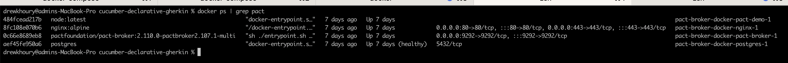
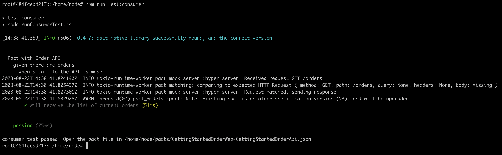
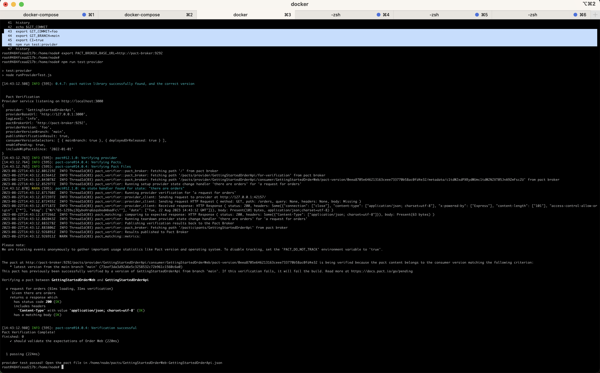
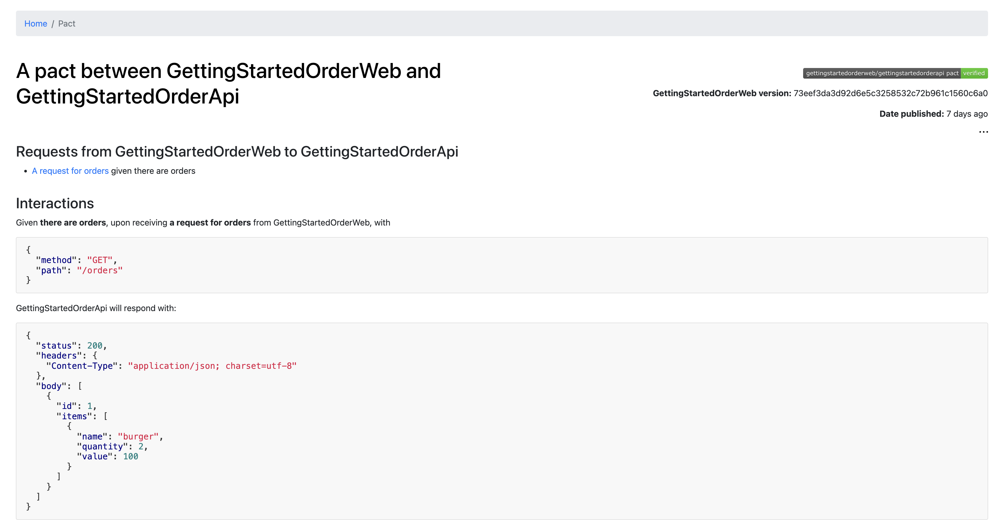
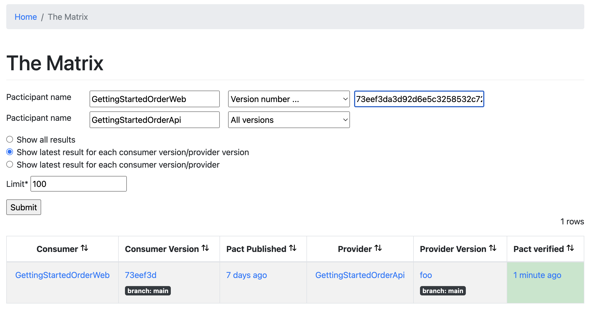

# quick dockerized steps

Setup the docker environment locally:

```
git clone git@github.com:my/repo/foo.git && cd foo && docker-compose up
```


---

Shell into container to run the demo:
```
docker exec -it pact-broker-docker-pact-demo-1 /bin/bash

cd /home/node
export GIT_COMMIT=foo
export GIT_BRANCH=main
export CI=true
git config --global --add safe.directory /home/node
```

---

Consumer:

```
npm install

# Run the consumer Tests
npm run test:consumer

# Sharing the contracts with the provider team
npm run pact:publish
```



---

Provider:

```
# Run the Provider tests
npm run test:provider
```



---

In the browser, pact (contract) between consumer and provider:



In the browser, matrix of versions:




# steps to do from public repos from scratch

```
# you need this first
git clone git@github.com:pact-foundation/pact-5-minute-getting-started-guide.git

# --- run broker
# ----------------------------------------------------------------------
#
# if using mac silicon, update image in compose file to append `-multi`:
# image: "pactfoundation/pact-broker:2.110.0-pactbroker2.107.1-multi"
#
# create the following service in docker-compose.yml:
#
#   pact-demo:
#     image: node:latest
#     command: tail -f /dev/null
#     volumes:
#       - ../pact-5-minute-getting-started-guide:/home/node
#     environment:
#       PACT_BROKER_BASE_URL: http://pact-broker:9292
#       GIT_COMMIT: foo
#       GIT_COMMIT: bar
#       CI: true
#
git clone git@github.com:pact-foundation/pact-broker-docker.git
cd pact-broker-docker
docker-compose up

# --- pact demo
# ----------------------------------------------------------------------

# connect to container that got created by compose
docker exec -it pact-broker-docker-pact-demo-1 /bin/bash

# run node deps (could be done at build time if you really wanted)
cd /home/node
npm install

# run tests defined in ./consumer/consumer.spec.js
# will generate pact file:  ./pacts/GettingStartedOrderWeb-GettingStartedOrderApi.json
npm run test:consumer

# publish pact file to broker - this will run ./publish.sh
git config --global --add safe.directory /home/node
npm run pact:publish

# run tests defined in ./provider/provider.spec.js
# will generate pact file:  ./pacts/GettingStartedOrderWeb-GettingStartedOrderApi.json
npm run test:provider
```